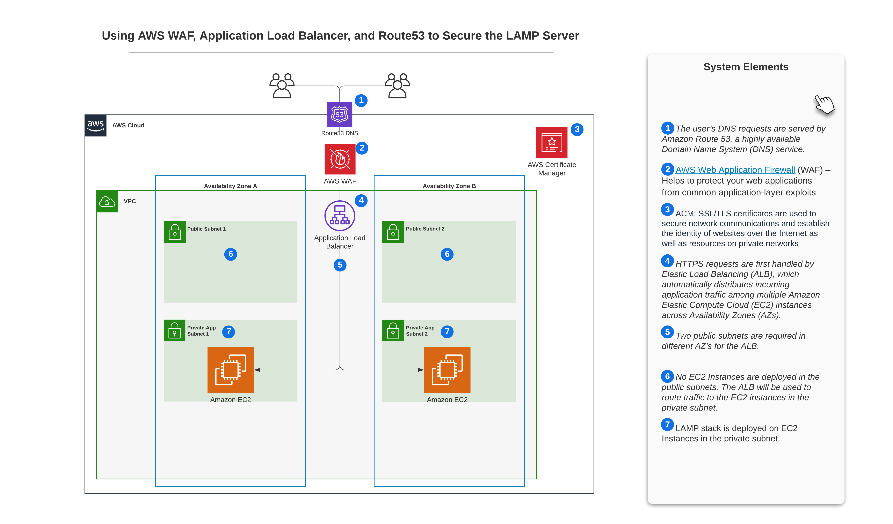

## **Using AWS Web Application Firewall and Amazon Route53 to secure the LAMP stack**

LAMP stands for Linux, Apache, MySQL, and PHP.  Together, they provide a time-tested stack of software for delivering high-performance web applications. LAMP has a classic layered architecture, with Linux at the lowest level. The next layer is Apache and MySQL, followed by PHP.

Customers can build a LAMP stack application from scratch or by following this [AWS tutorial](https://docs.aws.amazon.com/AWSEC2/latest/UserGuide/install-LAMP.html). However, the documentation does not dive deep into ways to secure the LAMP stack application against web application vulnerabilities and DDoS attacks. As with any open source project, LAMP stack applications are vulnerable to common web exploits and bots that may affect availability, compromise security, or consume excessive resources. Insecure open source code means software stacks are vulnerable and organizations remain exposed.

In this blog post, we give you prescriptive guidance and automation steps to deploy a secure and highly available LAMP stack application using AWS WAF, Application Load Balancer, AWS Route 53 and secured by a TLS certificate using AWS Certificate Manager. We walk you through how to launch this classic layered architecture LAMP stack application that can host a variety of popular web applications, such as WordPress, Wikipedia, and Drupal in minutes.

## Solution Overview

The following screenshot shows a high-level solution overview. 



## Walkthrough

We expect you to have the following ready before proceeding to the deployment steps:

- [Git](https://git-scm.com/book/en/v2/Getting-Started-Installing-Git)
- AWS account
- [AWS IAM](https://aws.amazon.com/iam/) user or role with appropriate permission 
- AWS VPC with an Internet gateway and a NAT gateway 
- Two public subnets in different Availability Zones 
- Two private subnets in different Availability Zones
- AWS Cloud Development Kit (AWS CDK)
- Public domain that you own
- Amazon Route 53 public hosted zone for the above domain
- AWS Certificate Manager (ACM) certificate for the above domain 


## Deployment steps 

At a high level, the steps here can be summarized as follows:

- Download the blog source code from the AWS public repo.
- On the development terminal, run the CDK deploy command to provision the LAMP stack
- On AWS management console, create a Route53 alias record.

### Clone the Repository

Clone [the ](https://github.com/aws-samples/zero-administration-inference-with-aws-lambda-for-hugging-face)repository to your development environment:

 For HTTP
```
$git clone https://gitlab.aws.dev/alasfour/cdk-lampstack
```

For SSH
```
$git clone [git@ssh.gitlab.aws.dev:alasfour/cdk-lampstack.git](mailto:git@ssh.gitlab.aws.dev:alasfour/cdk-lampstack.git) 
```

This [repository](https://github.com/aws-samples/aws-cdk-pipelines-datalake-infrastructure) contains the following reusable resources:

- CDK Application
- AWS WAF
- Amazon EC2
- AWS IAM role
- AWS Auto scaling
- AWS Route 53
- Application Load Balancer

### Create a virtual environment and install dependencies

Navigate to the project directory and create a virtual python environment for CDK.
```
$ python3 -m venv .env
```
Once the virtual environment is created, use the following step to activate it.
```
$ source .env/bin/activate
```
Once the virtual environment is activated, install the required dependencies. 
```
$ pip3 install -r requirements.txt
```

To add any additional dependencies, for example other CDK libraries, add to requirements.txt file and rerun the pip install -r requirements.txt command.

### Bootstrap

Deploying AWS CDK apps into an AWS environment may require that you provision resources the AWS CDK needs to perform the deployment. The process of provisioning these initial resources is called [bootstrapping](https://docs.aws.amazon.com/cdk/latest/guide/bootstrapping.html). If you have not bootstrapped your AWS account yet, then cdk deploy will fail due to missing required SSM parameters. The following example illustrates bootstrapping of your AWS environment.


```
$ cdk bootstrap aws://<account-number>/<region>
```

### Create the LAMP stack

On your development terminal, configure the CDK context parameters that will be used to provision the LAMP stack in your AWS account.

```
$ vi vars.py
# (Update the variables for your environment)
var_region = '<region>'
var_vpc_id = "<vpc-id>" # Import an Exist VPC
var_account_id = '<aws-account-number>'
var_ec2_type = "<t2.micro>"
cert_arn = "<certificate-arn>"
```


Now provision the LAMP stack using cdk deploy. It should take five to six minutes to complete the deployment.
```
$ cdk ls
$ cdk deploy –all
```

### Create Route53 Alias record

Create an [Amazon Route 53 alias record](https://docs.aws.amazon.com/Route53/latest/DeveloperGuide/resource-record-sets-creating.html) for your Domain and map it to the DNS name of the Application load balancer that just got created. 

## Code
The code is available [here](https://github.com/aws-samples) to download.


## Validation

Now, we have successfully provisioned the LAMP stack application with the following resources.

- Created an [AWS WAF](https://aws.amazon.com/waf/) which will protect the LAMP stack application against common web exploits, such as SQL injection and cross-site scripting.

- Launched an [Amazon EC2 Auto Scaling group](https://docs.aws.amazon.com/autoscaling/ec2/userguide/what-is-amazon-ec2-auto-scaling.html) where we deployed the LAMP stack

- Created an [AWS Route 53 alias record](https://docs.aws.amazon.com/Route53/latest/DeveloperGuide/resource-record-sets-creating.html) to [route traffic](https://docs.aws.amazon.com/Route53/latest/DeveloperGuide/routing-to-elb-load-balancer.html) to the [Application Load Balancer](https://docs.aws.amazon.com/elasticloadbalancing/latest/application/introduction.html)

Customers can now create a secure and highly available LAMP stack application and provision and manage them in an orderly and predictable fashion. Developers can deploy and update all the AWS resources mentioned above in a simple, declarative style that abstracts away the complexity of specific resource APIs.

You can test your LAMP application by typing the Route 53 DNS address in a web browser. When you add content to the document root, your content appears instead of the following test page.


## Cleanup 

To avoid ongoing charges in your AWS account, you should delete the AWS resources created in this blog post. On your development environment terminal, go to folder cdk-lampstack and destroy the stack using cdk destroy. As well, login to AWS Management console and delete the resources.

## Conclusion

In this blog post, we have provided prescriptive guidance and automation steps to setup up a secure and highly available LAMP stack application with AWS WAF, Route 53 Domain, and AWS Certificate Manager. We used AWS Cloud Development Kit (AWS CDK) to define the LAMP stack infrastructure as code and provision it without any performance impact or operational overhead. Companies of any size can adopt this approach to build secure, high-performing, resilient, and efficient infrastructure for their LAMP stack applications and workloads.


For further reading, refer to [AWS Well-Architected Framework](https://aws.amazon.com/architecture/well-architected/), [Architecture Best Practices for Compute](https://aws.amazon.com/architecture/compute-hpc/) and [Best Practices for Security, Identity, & Compliance](https://aws.amazon.com/architecture/security-identity-compliance/). We are here to help, and if  you need further assistance, please reach out to [AWS Support](https://aws.amazon.com/contact-us/) and your AWS account team.

## Security

See [CONTRIBUTING](CONTRIBUTING.md#security-issue-notifications) for more information.

## License

This library is licensed under the MIT-0 License. See the LICENSE file.

